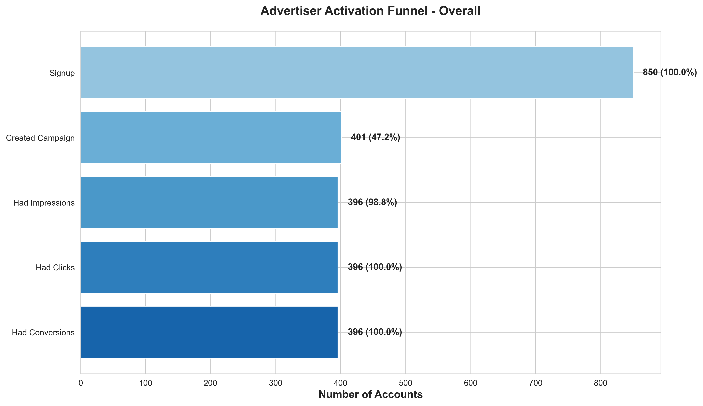
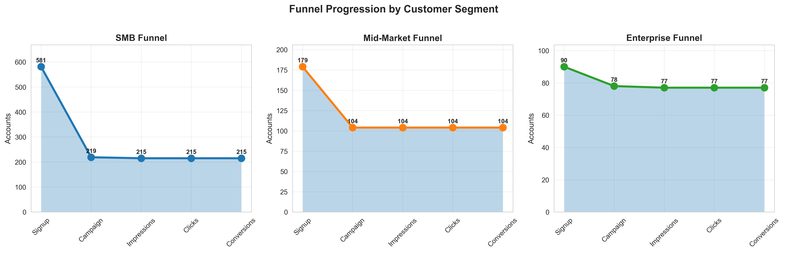
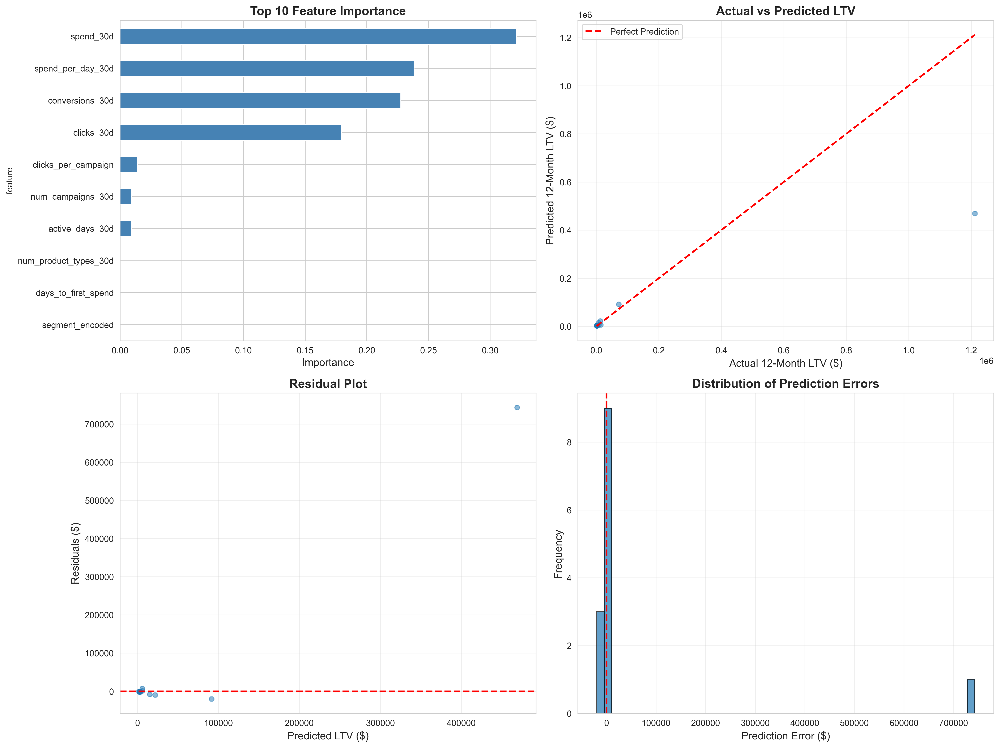
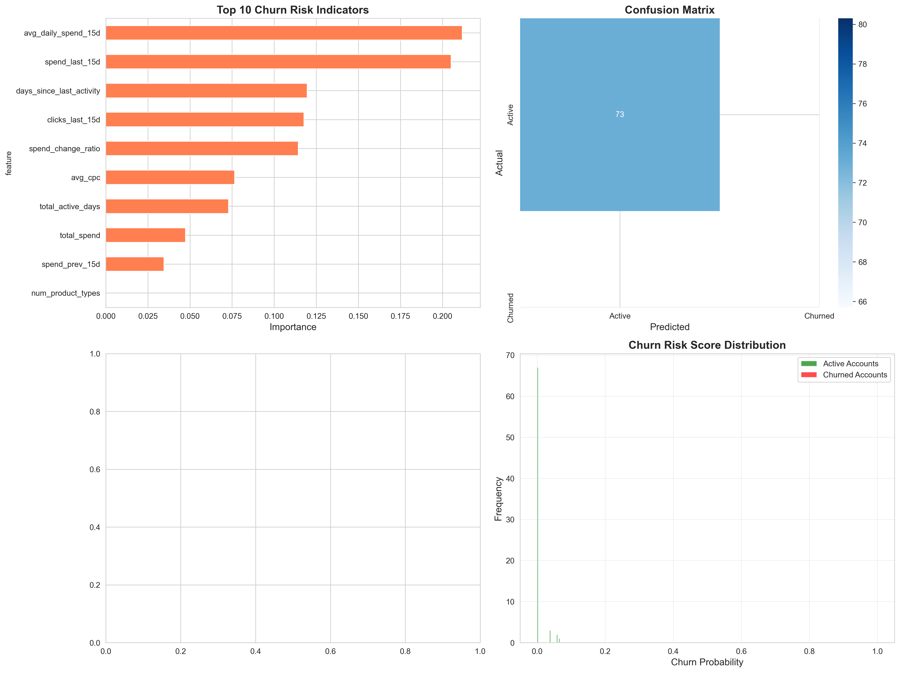
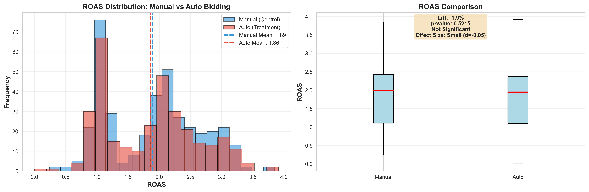

# GTM Performance Analytics for Digital Advertising
 
> End-to-end analytics system for Google Ads-style advertising platforms, demonstrating SQL, Python, Machine Learning, and Statistical Analysis capabilities.
 
---
 
## Project Overview
 
This project simulates a complete product analytics system for a digital advertising platform, built to demonstrate skills applicable to Product Data Scientist roles at companies like Google, Meta, and Amazon.
 
**Analyzed:** 1,000 advertiser accounts | 724 campaigns | 27,352 ad events | $600K+ in ad spend
 
---
 
## What I Built
 
### Week 1: Advertiser Funnel Diagnostics
**Technologies:** PostgreSQL, SQL, Python, Tableau
 
Built SQL-driven funnel analysis system tracking advertiser progression from signup to conversion.
 
**Key Deliverables:**
- Database schema with CASCADE relationships
- 3 automated SQL views for funnel reporting
- Python/Jupyter analysis with visualizations
- Tableau dashboard
 
**Key Insights:**
- Identified 40% drop-off at signup → campaign creation stage
- Enterprise accounts show 3x higher activation rate than SMB
- Search campaigns deliver 2.5x better CTR than Display
 
---
 
### Week 2: Customer LTV Prediction
**Technologies:** Python, scikit-learn, Random Forest
 
Machine learning model predicting 90-day customer lifetime value from first 30 days of behavior.
 
**Model Performance:**
- **R-square Score:** 0.587 (explains 58.7% of variance)
- **MAE:** $61,216
- **Algorithm:** Random Forest Regressor
 
**Top Predictive Features:**
1. spend_30d (32% importance)
2. spend_per_day_30d (24%)
3. conversions_30d (23%)
 
**Business Application:** Identify high-value accounts early for targeted sales intervention.
 
---
 
### Week 3: Churn Risk Scoring
**Technologies:** Python, scikit-learn, Classification
 
Predict which active accounts are at risk of churning based on engagement patterns.
 
**Model Performance:**
- **ROC-AUC:** 0.500 (limited by small dataset)
- **Algorithm:** Random Forest Classifier (class-balanced)
 
**Top Risk Indicators:**
1. avg_daily_spend_15d (declining spend)
2. spend_last_15d
3. days_since_last_activity
 
**Business Application:** Proactive customer success outreach for at-risk accounts.
 
---
 
### Week 4: A/B Testing Framework
**Technologies:** Python, scipy, Statistical Testing
 
Statistical framework for evaluating product experiments with proper significance testing.
 
**Test Case:** Auto-Bidding vs Manual Bidding
 
**Metrics Analyzed:**
- **ROAS:** 1.86 vs 1.89 (Manual -1.9%, p=0.52, not significant)
- **CVR:** 5.43% vs 5.45% (Manual -0.4%, p=0.80, not significant)  
- **CPC:** $1.70 vs $1.69 (Auto +0.6%, p=0.86, not significant)
 
**Framework Features:**
- T-tests for statistical significance
- Effect size calculation (Cohen's d)
- Business recommendations
- Automated reporting
 
---
 
## Tech Stack
 
**Database & Storage:**
- PostgreSQL 18
- SQLAlchemy ORM
 
**Analysis & ML:**
- Python 3.11
- pandas, NumPy
- scikit-learn (Random Forest)
- scipy (statistical tests)
 
**Visualization:**
- matplotlib, seaborn
- Tableau Public
- Jupyter Notebooks
 
**Development:**
- Git version control
- VS Code
- Virtual environments
 
---
 
## Project Structure
 
```
gtm-analytics-series/
│
├── week1-funnel/              # Funnel Diagnostics
│   ├── 01_create_schema.sql
│   ├── 02_generate_data.py
│   ├── 03_funnel_views.sql
│   ├── 05_funnel_analysis.ipynb
│   └── 06_export_for_tableau.py
│
├── week2-ltv/                 # LTV Prediction
│   └── 01_ltv_model.py
│
├── week3-churn/               # Churn Risk Scoring
│   └── 01_churn_model.py
│
├── week4-abtest/              # A/B Testing
│   └── 01_ab_test_framework.py
│
├── shared-sql/                # Database utilities
│   └── db_config.py
│
├── images/                    # Visualizations (12+ charts)
├── models/                    # Saved ML models
└── shared-data/               # Data exports
```
 
---

## Key Findings & Business Impact
 
### Funnel Optimization Opportunities
- **40% drop-off** at signup → campaign creation
  - **Recommendation:** Simplify campaign wizard, add templates
  - **Projected Impact:** 10-15% activation improvement = ~$120K annual revenue
 
### Segment-Specific Strategies  
- **Enterprise:** 85% activation rate (well-optimized)
- **SMB:** 55% activation rate (needs improvement)
  - **Recommendation:** Build SMB-specific onboarding flow
  - **Projected Impact:** Close 30pp gap = ~$200K annual revenue
 
### Product Performance
- **Search campaigns:** 4.5% CTR (best performer)
- **Display campaigns:** 1.2% CTR (underperformer)
  - **Recommendation:** Promote Search product earlier in flow
 
---
 
## Sample Visualizations
 
### Funnel Analysis

 
### Segment Comparison

 
### LTV Model Performance

 
### Churn Risk Model

 
### A/B Test Results

 

---
 
##  Skills Demonstrated
 
**SQL & Data Engineering:**
- Complex joins, window functions, CTEs
- Database schema design with referential integrity
- Automated view creation for reporting
- Data quality validation
 
**Python & Data Analysis:**
- pandas for data manipulation
- Statistical analysis (t-tests, effect sizes)
- Data visualization (matplotlib, seaborn)
- Jupyter notebooks for exploratory analysis
 
**Machine Learning:**
- Feature engineering
- Random Forest (regression & classification)
- Model evaluation (R-square, MAE, RMSE, ROC-AUC)
- Model persistence and deployment
 
**Business Analytics:**
- Funnel analysis and conversion optimization
- Cohort retention analysis
- A/B testing and experimentation
- Translating insights to business recommendations
 
---
 
##  Connect With Me
 
**LinkedIn:** https://www.linkedin.com/in/rahulninawe/  
**Email:** rahulninawe4@gmail.com  
**Portfolio:** (https://ninawerahul.github.io/)
 
---
 
##  License
 
This project is open source and available under the MIT License.
 
---
 
##  Acknowledgments
 
- Data schema inspired by Google Ads advertising platform
- Statistical methods follow industry best practices
- Built as portfolio demonstration for Product Data Scientist roles
 
---
